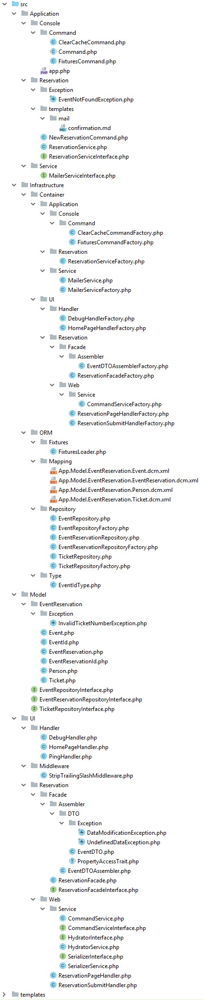

# Event reservation

*[DDD](https://en.wikipedia.org/wiki/Domain-driven_design) sample application based on the schema.org [EventReservation](https://schema.org/EventReservation) model.*

This application, inspired by [Codeliner's sample](https://github.com/codeliner/php-ddd-cargo-sample), shows a similar way to implement the Domain-driven design on top of the Zend Expressive framework. 

- Choose an event you want to go.
- Fill in a form to reserve your seat.
- The application will generate a ticket and send you a confirmation email.

## Installation

```bash
$ git clone https://github.com/Antoine87/ddd-event-reservation.git
$ cd ddd-event-reservation/
$ composer install
```

## Start the application

Either
```bash
$ php -S 0.0.0.0:8080 -t public/ public/index.php
```
Or Zend Expressive default script. ([see the doc](https://docs.zendframework.com/zend-expressive/v3/getting-started/quick-start/))
```bash
$ composer run --timeout=86400 serve
```

By default the application is shipped and configured to use a ``sample.db`` sqlite database in the data folder.


## Testing

Both coding style and unit tests :
```bash
$ composer check
```

## File hierarchy

<details>
  <summary>CLICK ME</summary>
<p>



</details>
